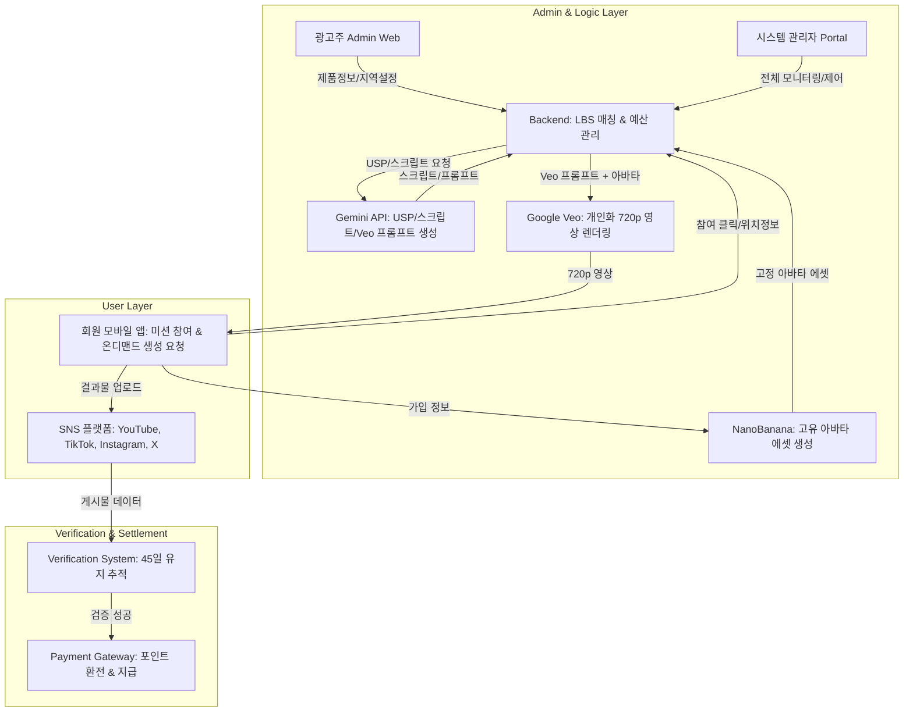

# ClickPost (클릭포스트) 프로젝트 가이드라인 (v2.0)

본 문서는 **ClickPost** 시스템 개발 시 항상 반영해야 할 핵심 비즈니스 로직, 데이터베이스 구조 및 개발 로드맵을 상세히 기록한 가이드라인입니다.

---

## 1. 프로젝트 개요 (Project Overview)
- **프로젝트명**: ClickPost (클릭포스트)
- **핵심 컨셉**: 고정 AI 아바타 기반의 자동화 마케팅 플랫폼.
- **차별화 포인트**:
    - 회원 정보를 바탕으로 **고유한 AI 페르소나(Seed ID)**를 부여하여 콘텐츠 일관성 확보. (**NanoBanana** 최신 버전 사용)
    - 일반 유저는 "고정 보상형 미션", 1만 명 이상 인플루언서는 "광고주 직거래형(역제안) 미션" 수행.
    - 글로벌 환율 및 다양한 로컬 페이먼트 지원을 통한 글로벌 확장성.
    - **Global Video First**: YouTube, TikTok, Instagram, X 등 글로벌 영상 플랫폼에 집중 (15~40초 분량, 720p 품질).

---

## 2. 고도화된 사업 구조 (Business Model)

### A. 아바타 고정 시스템 (Fixed AI Identity)
- **데이터 기반 생성**: 가입 정보(이름, 생년월일, 성별, 국가)를 기반으로 **NanoBanana** 최신 버전을 사용하여 고유한 '페르소나 ID' 부여.
- **일관성 유지**: 한 번 생성된 아바타는 정면, 측면, 전신 등 다양한 각도에서도 동일한 인물로 렌더링되어 회원의 퍼스널 브랜딩과 광고 신뢰도 극대화.

### B. 이원화된 수익 모델 (Two-Tier Revenue)
1. **일반 미션 (Standard)**: 시스템이 책정한 고정 포인트(영상 플랫폼별 구분)를 받고 참여하는 형태.
2. **프리미엄 매칭 (Premium)**: 1만 명 이상의 팔로워 보유 회원이 광고주에게 직접 단가를 제안(역제안)하거나 선택받는 형태.

### C. 수수료 및 정산 구조
- **플랫폼 수수료**: 광고주 결제 대금의 **15~40%**를 플랫폼 수수료로 취득.
- **에스크로(Escrow) 방식**: 광고주가 전체 캠페인 예산을 플랫폼에 예치하면, 플랫폼이 환율을 자동 계산하여 회원에게 포인트로 분배.

---

## 3. 단계별 업무 프로세스 (End-to-End Workflow)

광고주의 예산 효율성을 높이고, 회원의 참여를 극대화하며, 운영 자동화를 실현하는 데 초점을 맞춥니다.

### Step 1: 광고 캠페인 설계 및 분석 (Advertiser Web)
1. **정보 입력**: 광고주가 제품/서비스 상세 내용(URL 또는 텍스트)과 타겟 조건(지역, 성별, 연령대)을 입력합니다.
2. **USP 추출 (Gemini)**: Gemini API가 입력된 정보를 분석하여 5가지 핵심 특징(Unique Selling Point)을 정의합니다.
3. **예산 예치**: 광고주가 전체 캠페인 예산을 결제합니다. (플랫폼 수수료 15~40% 포함)

### Step 2: 타겟 필터링 및 미션 배분 (Backend)
1. **LBS 매칭**: 회원의 최신 GPS 위치 정보와 광고주가 설정한 타겟 지역을 비교하여 대상 회원군을 추출합니다.
2. **프로 인플루언서 매칭**: 1만 명 이상 팔로워 보유자에게는 프리미엄 미션으로 별도 노출 및 제안을 발송합니다.
3. **스크립트 및 키워드 생성 (Gemini)**: Gemini API가 추출한 5개 특징을 기반으로 100개의 서로 다른 **영상 스크립트 및 포스팅 키워드**를 생성합니다.
4. **비디오 생성 프롬프트 작성 (Gemini)**: 생성된 각 스크립트에 최적화된 **Google Veo 전용 영상 제작 프롬프트**를 Gemini가 자동으로 작성합니다.

### Step 3: 온디맨드(On-demand) 콘텐츠 생성 (Mobile App)
*이 단계가 비용 관리의 핵심입니다.*
1. **참여 신청**: 회원이 미션 리스트를 보고 '참여하기' 버튼을 클릭합니다.
2. **맞춤 영상 제작 (Google Veo)**: 버튼 클릭 시점에 해당 회원의 **고정 Seed(아바타)**와 Gemini가 작성한 전용 프롬프트를 결합하여 **Google Veo(최신 가성비 버전)**에 영상 생성을 요청합니다.
   - **영상 스펙**: 15~40초 분량, 720p 해상도 (비용 최적화).
3. **가이드 제공**: 생성된 영상과 함께 Gemini가 생성한 키워드, 해시태그 가이드가 회원에게 전달됩니다.

### Step 4: SNS 업로드 및 검증 (User & System)
1. **포스팅**: 회원이 SNS(YouTube, TikTok, Instagram, X 등)에 결과물을 업로드합니다.
2. **URL 제출**: 앱 내에 업로드한 게시물의 링크를 제출합니다.
3. **1차 검증**: 시스템이 URL 유효성 및 필수 키워드 포함 여부를 즉시 확인하고 1차 포인트를 지급합니다.

### Step 5: 사후 관리 및 최종 정산 (Batch System)
1. **유지 여부 추적**: 45일 동안 매일 1회 포스팅 삭제 여부를 자동 체크합니다.
2. **보너스 지급**: 45일 경과 시점에 게시물이 유지되고 있다면 보너스 포인트를 자동 지급합니다.
3. **현금 환전**: 회원이 신청 시, 각국의 페이먼트 시스템(네이버페이, Grab 등)을 통해 현지 통화로 입금합니다.

---

## 4. API 비용 관리 전략 (Cost Management)

| 구분 | 전략 내용 | 기대 효과 |
| :--- | :--- | :--- |
| **Just-In-Time (JIT) 생성** | 캠페인 시작 시 100개를 미리 만들지 않고, 회원이 '참여하기'를 누른 시점에만 영상을 생성합니다. | 노쇼(No-show) 인원에 의한 비용 낭비 0% |
| **아바타 에셋 재사용** | 영상 전체를 매번 새로 렌더링하지 않고, **NanoBanana**로 생성된 고정 아바타 이미지를 기반으로 합성합니다. | AI API 호출 토큰 및 처리 시간 절감 |
| **스크립트 및 프롬프트 캐싱** | Gemini로 생성한 스크립트와 **Veo 전용 프롬프트**를 DB에 저장해두고 순차 배분합니다. | 중복적인 Gemini API 호출 비용 방지 |
| **저해상도/가성비 모델 선택** | Google Veo의 최신 가성비 모델을 사용하고 해상도를 **720p**로 제한합니다. | 고해상도(4K/8K) 대비 API 비용 50% 이상 절감 |
| **미션 선점제** | 예산에 맞춰 생성 가능한 영상 수를 제한하고, 참여 의사가 확실한 회원에게만 생성권을 부여합니다. | 예산 초과 집행 방지 및 캠페인 조기 최적화 |

---

## 5. 앱 주요 기능 상세 (Feature List)

### [1] AI 아바타 스튜디오 (Onboarding & Identity)
- **자동 생성 엔진**: 회원 정보를 조합해 **NanoBanana**를 통한 최적의 비주얼 프롬프트 및 Seed ID 생성.
- **에셋 라이브러리**: NanoBanana로 생성한 정면, 좌/우 45도(반측면), 측면, 전신 샷을 패키지로 저장하여 모든 콘텐츠 제작 시 일관되게 적용.

### [2] 캠페인 마켓플레이스 (Mission Center)
- **영상 플랫폼별 단가**: YouTube, TikTok, Instagram, X 등 플랫폼별 영향력에 따른 금액 차등 표시 (720p 영상 기준).
- **글로벌 환율 적용**: 사용자의 거주 국가에 맞춰 실시간 환율이 적용된 현지 통화 가치 표시.

### [3] 프로 인플루언서 대시보드 (For 10K+ Followers)
- **계정 인증**: SNS API(Instagram Graph API 등) 연동을 통한 팔로워 수 및 영향력 검증(매달 갱신).
- **역제안 시스템**: 광고주 캠페인에 자신의 파급력을 어필하며 직접 참여 신청 및 단가 제안.

### [4] 광고주 관리자 웹 (Advertiser Portal)
- **전체 예산 관리**: 특정 포스팅 단가 설정 및 총 광고 집행 금액 결제 및 예치.
- **실시간 리포트**: 떤 지역의 어떤 연령대 아바타 영상이 가장 높은 조회수(View)를 기록하는지 대시보드 제공.
- **인플루언서 승인**: 역제안을 신청한 프로 인플루언서 리스트를 확인하고 개별 승인/거절 처리.

---

## 6. AI 아바타 생성을 위한 프롬프트 전략

### 시스템 프롬프트 (Seed Prompt) 구조
가입 정보를 바탕으로 매번 동일한 고유 캐릭터를 생성하기 위한 템플릿입니다.

> **[프롬프트 템플릿]**
> "A highly detailed, photo-realistic AI avatar of a **[Age-based vibe]** **[Gender]** from **[Country]**. Name: **[Name-based style]**. Facial features: Consistent and unique. Clothing: Trendy casual. Generate 5 consistent views: 1. Full-face front view, 2. Half-side view (45 degrees left/right), 3. Profile view (90 degrees), 4. Full-body shot. High resolution, 8k, cinematic lighting, neutral background for easy compositing."

- **작동 원리**: 생년월일 → 연령대별 스타일(예: 20대 초반의 트렌디함), 국가 정보 → 인종적 특징 반영. 생성된 `Seed_ID`를 저장하여 영상 제작 시마다 동일 인물 재현.

---

## 7. 시스템 아키텍처 (Architecture)

---

## 8. 데이터베이스 설계 (Database Schema)

### ① 회원 및 고정 정체성 (Users & Avatars)
| 테이블명 | 필드명 | 타입 | 설명 |
| :--- | :--- | :--- | :--- |
| **Users** | user_id (PK) | UUID | 사용자 고유 ID |
| | birth_date | Date | 생년월일 (아바타 연령대 결정용) |
| | gender | Enum | 성별 (MALE, FEMALE, OTHER) |
| | country_code | String | 국가 (인종 및 문화권 특징 반영) |
| | follower_count | Int | 인증된 총 팔로워 수 (시스템 연동) |
| | is_pro_verified | Boolean | 1만 명 이상 팔로워 인증 여부 |
| | total_points | BigInt | 현재 보유 포인트 |
| **Avatars** | avatar_id (PK) | UUID | 아바타 고유 ID |
| | user_id (FK) | UUID | 소유자 ID |
| | seed_id | String | NanoBanana 고정 시드 값 |
| | persona_prompt | Text | 사용된 최종 비주얼 프롬프트 |
| | asset_front_url | Text | 정면 이미지 경로 |
| | asset_side_url | Text | 측면 이미지 경로 |
| | asset_half_url | Text | 반측면 이미지 경로 |
| | asset_full_url | Text | 전신 샷 이미지 경로 |

### ② 캠페인 및 예산 (Campaigns & Budget)
| 테이블명 | 필드명 | 타입 | 설명 |
| :--- | :--- | :--- | :--- |
| **Campaigns** | campaign_id (PK) | UUID | 캠페인 고유 ID |
| | advertiser_id | UUID | 광고주 ID |
| | total_budget | BigInt | 캠페인 총 예산 (플랫폼 예치금) |
| | fee_rate | Float | 플랫폼 수수료율 (0.15 ~ 0.40) |
| | video_reward | Int | 영상 포스팅 기본 보상 |
| | bonus_45d | Int | 45일 유지 보너스 금액 |
| | target_platform | Enum | 배포 플랫폼 (YOUTUBE, TIKTOK, INSTA, X) |
| | status | Enum | 상태 (READY, ACTIVE, EXHAUSTED, CLOSED) |

### ③ 인플루언서 역제안 (Influencer Offers)
| 테이블명 | 필드명 | 타입 | 설명 |
| :--- | :--- | :--- | :--- |
| **InfluencerOffers**| offer_id (PK) | UUID | 제안 고유 ID |
| | campaign_id (FK) | UUID | 대상 캠페인 ID |
| | user_id (FK) | UUID | 인플루언서 ID |
| | sns_account_info | JSON | 신청 시점의 계정 통계(팔로워 등) |
| | requested_amount | Int | (선택) 인플루언서 희망 단가 |
| | status | Enum | 상태 (PENDING, APPROVED, REJECTED) |
| | approved_at | DateTime | 광고주 승인 시간 |

### ④ 미션 수행 및 콘텐츠 (Submissions & Contents)
| 테이블명 | 필드명 | 타입 | 설명 |
| :--- | :--- | :--- | :--- |
| **MissionContents**| content_id (PK) | UUID | 제작된 콘텐츠 ID |
| | user_id (FK) | UUID | 대상 회원 ID |
| | campaign_id (FK) | UUID | 캠페인 ID |
| | ai_video_url | Text | 생성된 아바타 영상 경로 |
| | ai_script | Text | 생성된 포스팅 가이드 텍스트 (Gemini 생성) |
| **Submissions** | sub_id (PK) | UUID | 제출 ID |
| | content_id (FK) | UUID | 관련 콘텐츠 ID |
| | sns_url | Text | 회원이 업로드한 게시글 링크 |
| | status | Enum | 상태 (SUBMITTED, VERIFIED, FAILED) |
| | is_retained_45d | Boolean | 45일 유지 보너스 지급 여부 |

---

---

## 9. 데이터 통합 및 저장 흐름 (Data Integration & Storage Flow)

시스템의 각 단계에서 데이터가 저장되고 관리되는 상세 흐름입니다.

### A. 회원 가입 및 아바타 생성 (Onboarding)
1. **데이터 생성**: `PersonaEngine`을 통해 고유 `seed_id`와 페르소나 프롬프트 생성.
2. **이미지 생성**: NanoBanana 엔진을 호출하여 5가지 각도의 정적 이미지 세트 생성.
3. **Storage 저장**: 생성된 5장의 이미지를 Supabase Storage의 `avatars` 버킷에 유저별 폴더 구조로 저장.
4. **DB 기록**: `Avatars` 테이블에 `seed_id`, 프롬프트, Storage 이미지 URL(5종)을 모두 기록.

### B. 미션 참여 및 영상 생성 (Campaign Execution)
1. **데이터 조회**: 회원이 미션 '참여하기' 클릭 시, `Avatars` 테이블에서 해당 유저의 `seed_id`를 조회.
2. **영상 요청**: 조회된 `seed_id`와 Gemini가 생성한 스크립트를 결합하여 Google Veo API에 영상 생성 요청.
3. **영상 저장**: Veo에서 생성이 완료되면 결과물을 Supabase Storage의 `user_videos` 버킷에 저장.
4. **결과 기록**: 생성된 영상의 Storage URL을 `MissionContents` 테이블의 `ai_video_url` 필드에 업데이트.

### C. 미션 제출 및 검증 (Submission & Verification)
1. **URL 제출**: 회원이 SNS에 업로드한 실제 포스팅 주소를 제출.
2. **DB 기록**: `Submissions` 테이블에 해당 SNS 링크(`sns_url`)와 상태를 기록.
3. **상태 관리**: 45일 유지 여부에 따라 `is_retained_45d` 필드를 업데이트하고 정산 프로세스로 전달.

---

## 10. 개발 로드맵 (Roadmap)

### Phase 1: 기반 구축 및 아바타 MVP
- 고정 아바타 생성 로직(AI Seed/Prompt) 및 Asset 보관 시스템 구현.
- 회원용 모바일 앱(Expo) 기초 UI 및 프로필 설정 개발.
- Gemini API 연동: USP 추출 및 스크립트 자동 생성 모듈 개발.

### Phase 2: 온디맨드 영상 생성 및 광고주 시스템
- JIT(Just-In-Time) 영상 생성 로직 및 AI 비디오 엔진 연동.
- 광고주 관리 웹 대시보드(리포트 포함) 및 인플루언서 역제안 시스템 구축.
- 캠페인 예산 예치(Escrow) 및 수수료 자동 계산 모듈 개발.

### Phase 3: 자동화 및 글로벌 확장
- 45일 게시물 유지 추적 자동화 배치 프로그램 개발 (SNS 스크래핑/API 활용).
- 실시간 환율 연동 및 글로벌 페이먼트(네이버/카카오/Grab 등) API 연동.
- 정산 투명성 확보를 위한 상세 트랜잭션 로그 강화.

---

## 11. 관리자 시스템 (System Admin Portal)

시스템의 전체 건강 상태와 주요 지표를 실시간으로 관리하고 AI 설정을 최적화하는 통합 컨트롤 타워입니다.

### [1] 대시보드 및 실시간 모니터링 (Dashboard)
- **주요 지표(KPI)**: 총 광고 집행 금액, 플랫폼 누적 수수료 수익, 활성 캠페인 수, 신규 가입자 수.
*   **LBS 기반 활동 지도**: 현재 지역별 미션 수행 현황을 지도로 시각화(유저 밀집도 확인).
*   **API 비용 트래커**: Gemini, NanoBanana, Veo 등의 API 사용량 및 예상 비용 실시간 모니터링.

### [2] 캠페인 및 광고주 관리 (Campaign & Advertiser)
- **AI 스크립트 오케스트레이션**: 
    - 광고주 입력 정보를 기반으로 Gemini가 추출한 5대 특징 검토 및 수정.
    - 자동 생성된 100개의 스크립트 목록 확인 및 개별 편집 기능.
- **타겟팅 설정**: 캠페인별 타겟 지역, 성별, 연령대 설정 및 가용 회원 수 조회.
- **예산 관리**: 예치된 예산 대비 소진율 관리, 수수료율(15~40%) 설정.

### [3] 회원 및 고정 아바타 관리 (User & Avatar)
- **페르소나 스튜디오**: 
    - 회원별 Seed ID 및 생성된 8종 에셋(정면, 측면, 전신 등) 조회.
    - 아바타 생성 실패 시 재생성(Regenerate) 트리거 기능.
- **인플루언서 검증**: 
    - 1만 명 이상 팔로워 보유 회원의 'Pro' 등급 승인.
    - 회원별 위치 데이터 로그 확인(LBS 타겟팅 정확도 제고).

### [4] 미션 및 콘텐츠 검증 (Content & Verification)
- **URL 검증 데스크**: 회원이 제출한 SNS 링크의 유효성 실시간 확인.
- **45일 추적 자동화 로그**: 삭제된 게시물 실시간 감지 및 보너스 지급 대상자 자동 필터링.
- **부정행위 감지**: 동일 영상 중복 업로드, 비공개 계정 전환 등을 AI로 탐지하여 제재.

### [5] 정산 및 금융 시스템 (Finance & Payout)
- **정산 승인 대기열**: 회원 출금 요청(네이버페이, Grab 등) 건별 승인/거절.
- **자동 환율 설정**: 실시간 외부 환율 API 연동을 통한 변환 기준 설정.
- **수수료 리포트**: 광고주별, 기간별 플랫폼 순수익 통계 보고서 생성.

### [6] AI 설정 및 시스템 최적화 (System Settings)
- **API 모델 스위칭**: Gemini 1.5 Pro/Flash 등 모델 버전 선택적 적용.
- **On-demand 생성 제어**: 서버 부하에 따른 영상 생성 큐(Queue) 속도 조절.

---

## 12. 비용 최적화 특화 기능 (Cost Defense Mode)

관리자의 운영 비용을 최소화하기 위한 "생성 비용 방어 모드"를 운영합니다.

- **미션 조기 마감**: 광고주 예산의 **95% 소진 시** 자동으로 신규 영상 생성 API 호출을 차단합니다.
- **아바타 캐시 관리**: Storage에 저장된 고정 아바타 이미지를 우선적으로 재사용하여 불필요한 AI 생성 비용을 방지합니다.

---
**최종 수정일**: 2026-04-22
**작성자**: ClickPost 개발 팀
