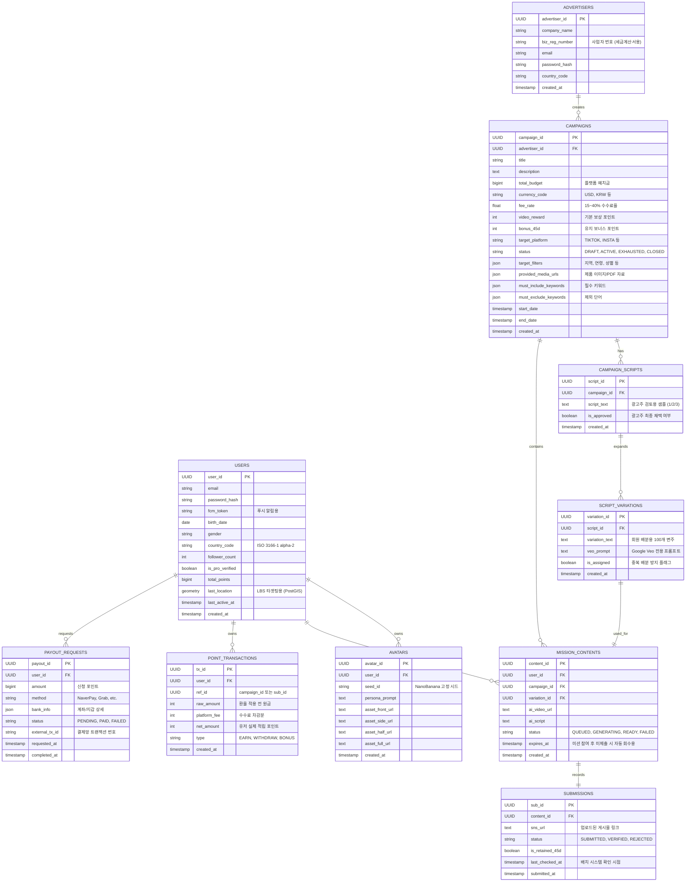

# ClickPost (클릭포스트) 프로젝트 가이드라인 (v2.1)

본 문서는 **ClickPost** 시스템 개발 시 항상 반영해야 할 핵심 비즈니스 로직, 데이터베이스 구조 및 개발 로드맵을 상세히 기록한 최종 가이드라인입니다.

---

## 1. 프로젝트 개요 (Project Overview)
- **프로젝트명**: ClickPost (클릭포스트)
- **핵심 컨셉**: 고정 AI 아바타 기반의 자동화 마케팅 플랫폼.
- **플랫폼 구조 (3-Tier)**:
    1. **Mobile App (인플루언서/회원용)**: 미션 참여, 온디맨드 영상 생성 및 SNS 업로드.
    2. **Responsive Web App (광고주용)**: 기기에 구애받지 않는 캠페인 등록, 키워드 설정, AI 스크립트 3종 검토 및 결제.
    3. **Admin Web (관리자용)**: 전체 시스템, 재무 지표 및 AI 리소스 통합 제어.
- **차별화 포인트**:
    - 회원 정보를 바탕으로 **고유한 AI 페르소나(Seed ID)**를 부여하여 콘텐츠 일관성 확보. (**NanoBanana** 최신 버전 사용)
    - 일반 유저는 "고정 보상형 미션", 1만 명 이상 프로 인플루언서는 "광고주 직거래형(역제안) 미션" 수행.
    - 글로벌 환율 및 다양한 로컬 페이먼트 지원을 통한 글로벌 확장성.
    - **Global Video First**: YouTube, TikTok, Instagram, X 등 글로벌 숏폼 플랫폼 최적화 (15~40초 분량, 720p 품질).
- **메인 AI 엔진**: **gemini-3-flash** (USP 추출, 스크립트 생성, Veo 프롬프트 작성의 핵심 엔진으로 활용).

---

## 2. 고도화된 사업 구조 (Business Model)

### A. 아바타 고정 시스템 (Fixed AI Identity)
- **데이터 기반 생성**: 가입 정보(이름, 생년월일, 성별, 국가, 키, 몸무게)를 기반으로 **NanoBanana** 최신 버전을 사용하여 고유한 '페르소나 ID(Seed ID)' 부여.
- **일관성 유지**: 한 번 생성된 아바타는 정면, 측면, 전신 등 다양한 각도에서도 동일한 인물로 렌더링되어 회원의 퍼스널 브랜딩과 광고 신뢰도 극대화.

### B. 이원화된 수익 모델 (Two-Tier Revenue)
1. **일반 미션 (Standard)**: 시스템이 책정한 고정 포인트를 받고 참여하는 형태.
2. **프리미엄 매칭 (Premium)**: 1만 명 이상의 팔로워 보유 회원이 광고주에게 직접 단가를 제안(역제안)하거나 선택받는 형태.

### C. 수수료 및 정산 구조
- **플랫폼 수수료**: 광고주 결제 대금의 **15~40%**를 플랫폼 수수료로 취득.
- **에스크로(Escrow) 방식**: 광고주가 전체 캠페인 예산을 플랫폼에 예치하면, 플랫폼이 환율을 자동 계산하여 회원에게 포인트로 분배.

---

## 3. 단계별 업무 프로세스 (End-to-End Workflow)

광고주의 캠페인 등록 과정에 검토 단계를 추가하여 AI 결과물에 대한 신뢰도를 높이고, 인플루언서의 비용 효율적인 참여를 유도합니다.

### Step 1: 광고 캠페인 설계 및 검토 (Advertiser Responsive Web)
1. **자료 및 타겟팅 입력**: 광고주가 제품/서비스의 이미지, 설명 자료 등을 업로드하고 타겟 조건(지역, 성별, 연령대)을 설정합니다.
2. **키워드 제어**: 캠페인에 반드시 포함되어야 할 필수 키워드와 절대 노출되지 않아야 할 **제외 단어(Negative Keywords)**를 입력합니다.
3. **샘플 스크립트 생성 및 승인 (Gemini)**: 
    - Gemini API가 입력된 자료와 키워드 조건을 분석하여 3개의 예제 스크립트를 생성합니다.
    - 광고주가 이를 검토 후 수정 또는 최종 승인(Approve)합니다.
4. **예산 예치**: 스크립트 승인 후, 광고주가 전체 캠페인 예산을 결제하면 캠페인이 활성화됩니다.

### Step 2: 스크립트 확장 및 미션 배분 (Backend)
1. **타겟 필터링 (LBS)**: 회원의 최신 위치 정보와 광고주가 설정한 타겟 지역을 매칭하여 대상 회원군을 추출합니다.
2. **프로 인플루언서 매칭**: 1만 명 이상 팔로워 보유자에게 프리미엄 미션 제안을 발송합니다.
3. **대량 스크립트 및 프롬프트 생성 (Gemini)**: 광고주가 승인한 샘플의 톤앤매너와 키워드 규칙을 바탕으로 100개의 서로 다른 영상 스크립트 및 포스팅 해시태그를 파생 생성(Caching)합니다. 동시에 Google Veo 전용 영상 제작 프롬프트를 자동 작성합니다.

### Step 3: 온디맨드(On-demand) 콘텐츠 생성 (Mobile App)
1. **참여 신청**: 회원이 앱에서 미션 리스트를 확인하고 '참여하기'를 클릭합니다.
2. **맞춤 영상 제작 (Google Veo)**: 클릭 시점에 회원의 **고정 Seed ID(아바타 에셋)**와 할당된 해당 회원의 전용 프롬프트를 결합해 **Google Veo(가성비 모델)**에 720p 영상 생성을 요청합니다.
3. **결과물 제공**: 완성된 숏폼 영상과 SNS 업로드용 텍스트 가이드가 회원에게 전달됩니다.

### Step 4: SNS 업로드 및 검증 (User & System)
1. **포스팅 및 제출**: 회원이 SNS에 업로드 후 앱 내에 게시물 링크(URL)를 제출합니다.
2. **1차 검증**: 시스템이 URL 유효성 및 필수 키워드 포함 여부를 즉시 확인하고 1차 포인트를 지급합니다.

### Step 5: 사후 관리 및 최종 정산 (Batch System)
1. **유지 여부 추적**: 45일 동안 매일 1회 포스팅 삭제 여부를 자동 체크합니다.
2. **보너스 지급**: 45일 유지 시 보너스 포인트를 자동 지급합니다.
3. **현금 환전**: 현지 통화(네이버페이, Grab 등)로 정산합니다.

---

## 4. API 비용 관리 전략 (Cost Management)

| 구분 | 전략 내용 | 기대 효과 |
| :--- | :--- | :--- |
| **Just-In-Time (JIT)** | 회원이 '참여하기'를 누른 시점에만 Veo 영상을 생성합니다. | 노쇼(No-show) 비용 낭비 원천 차단 |
| **아바타 에셋 재사용** | NanoBanana로 사전 생성된 고정 아바타 이미지를 결합하여 렌더링합니다. | AI 토큰 및 영상 처리 시간 대폭 절감 |
| **스크립트 사전 캐싱** | 광고주 승인 직후 100개의 스크립트를 미리 생성하여 DB에 저장 및 분배합니다. | 실시간 병목 현상 및 중복 API 호출 방지 |
| **저해상도 모델 고정** | 숏폼 플랫폼에 맞춘 720p 해상도 및 가성비 모델을 강제합니다. | 고해상도 대비 인프라 비용 50% 이상 절감 |
| **미션 선점제** | 예산에 맞춰 생성 가능한 영상 수량을 한정합니다. | 예산 초과 집행 방지 |

---

## 5. 플랫폼별 주요 기능 상세 (Feature List)

### [1] 인플루언서용 모바일 앱 (Mobile App)
- **AI 아바타 스튜디오**: 가입 시 자신의 생체/국가 정보를 바탕으로 고유한 Seed ID 및 5면 아바타 에셋(정면, 반측면, 측면, 전신 등) 자동 생성.
- **캠페인 마켓플레이스**: 플랫폼별(YouTube, TikTok 등) 단가 확인 및 실시간 환율이 적용된 미션 참여.
- **프로 인플루언서 대시보드 (10K+)**: SNS API 연동 계정 인증 및 광고주 대상 역제안 시스템.

### [2] 광고주용 반응형 웹 앱 (Advertiser Web App)
- **독립된 B2B 환경**: PC, Tablet, Mobile 어디서나 쾌적하게 캠페인을 관리할 수 있는 반응형 웹.
- **캠페인 빌더**: 제품 이미지 및 PDF 설명서 업로드, 타겟팅 설정.
- **정밀 키워드 엔진**: 필수 포함 키워드 및 반드시 제외할 단어(Negative Keywords) 명시 기능.
- **AI 스크립트 샌드박스**: Gemini가 제안한 3개의 샘플 스크립트를 미리보고 수정/최종 승인하는 프로세스.
- **실시간 퍼포먼스 보드**: 결제/예치 관리 및 노출, 조회수, LBS 기반 타겟 도달률 확인.
- **프로 인플루언서 승인 데스크**: 인플루언서의 역제안 내역 검토 및 개별 승인/거절.

### [3] 관리자 통합 웹 (Admin Web)
- **대시보드**: 총 광고 집행 금액, 누적 플랫폼 수수료, API 비용 실시간 트래커.
- **회원/아바타 관리**: 유저별 Seed ID 조회 및 아바타 재생성 트리거.
- **검증 데스크**: URL 검증 현황, 45일 자동 추적 로그 확인 및 어뷰징 탐지.

---

## 6. AI 아바타 생성을 위한 프롬프트 전략

### [프롬프트 템플릿]
> "A highly detailed, photo-realistic AI avatar of a **[Age-based vibe]** **[Gender]** from **[Country]**. Name: **[Name-based style]**. Facial features: Consistent and unique. Clothing: Trendy casual. Generate 5 consistent views: 1. Full-face front view, 2. Half-side view (45 degrees left/right), 3. Profile view (90 degrees), 4. Full-body shot. High resolution, 8k, cinematic lighting, neutral background for easy compositing."

---

## 7. 시스템 아키텍처 (Architecture)

```mermaid
graph TD
    subgraph "Advertiser Layer (Responsive Web)"
        AdWeb[광고주 웹: 캠페인 등록/키워드/자료 업로드]
        Review[스크립트 3종 검토 및 최종 승인]
        Payment[캠페인 예산 결제/예치]
        AdWeb --> Review
        Review --> Payment
    end

    subgraph "Admin & Logic Layer (Backend)"
        SystemAdmin[시스템 통합 관리자 Web]
        Gemini[Gemini API (gemini-3-flash): 샘플 3종 생성 -> 승인 후 100종 대량 파생]
        Backend[Backend API & DB: LBS 및 미션 큐 관리]
        NanoBanana[NanoBanana: 아바타 생성 엔진]
        VideoEngine[Google Veo: 720p 온디맨드 영상 렌더링]
    end

    subgraph "User Layer (Mobile App)"
        App[인플루언서 앱: 미션 수락 & 영상 생성 요청]
        SNS[SNS 플랫폼: YouTube, TikTok, Instagram 등]
    end

    Payment -->|결제 완료 및 조건 전달| Backend
    Backend <-->|조건 분석 및 스크립트 생성| Gemini
    App -->|가입 정보 전달| NanoBanana
    NanoBanana -->|고정 아바타 에셋 반환| Backend
    App -->|미션 참여 클릭| Backend
    Backend -->|Seed ID + 할당된 프롬프트| VideoEngine
    VideoEngine -->|맞춤형 720p 영상 반환| App
    App -->|포스팅 및 URL 제출| SNS
```

---

## 8. 데이터베이스 설계 (Database Schema)

### [ERD v2.1] 통합 데이터 관계도


### 상세 테이블 정의 및 핵심 제약 조건

#### ① 회원 및 아바타 (Users & Avatars)
| 테이블명 | 필드명 | 타입 | 설명 |
| :--- | :--- | :--- | :--- |
| **Users** | user_id (PK) | UUID | 사용자 고유 ID |
| | fcm_token | String | 푸시 알림 수신용 토큰 |
| | country_code | String | ISO 3166-1 alpha-2 국가 코드 |
| | total_points | BigInt | 현재 보유 포인트 (Atomic Update 권장) |
| | last_location | Geometry | PostGIS 포인트 (LBS 타겟팅용) |
| **Avatars** | avatar_id (PK) | UUID | 아바타 고유 ID |
| | seed_id | String | NanoBanana 고정 시드 값 |
| | asset_front_url 등 | Text | 정면/측면/전신 등 5종 에셋 경로 |

#### ② 광고주 및 캠페인 (Advertisers & Campaigns)
| 테이블명 | 필드명 | 타입 | 설명 |
| :--- | :--- | :--- | :--- |
| **Advertisers**| advertiser_id | UUID | 광고주 고유 ID |
| | biz_reg_number | String | 사업자 등록 번호 |
| **Campaigns** | campaign_id | UUID | 캠페인 고유 ID |
| | total_budget | BigInt | 캠페인 총 예치금 |
| | currency_code | String | 결제 통화 (USD, KRW, 등) |
| | target_filters | JSON | 지역, 연령, 성별 등 타겟 조건 |
| | sample_scripts | JSON | Gemini 생성 3종 샘플 (역사 관리용) |

#### ③ 스크립트 변주 및 콘텐츠 (Scripts & Contents)
| 테이블명 | 필드명 | 타입 | 설명 |
| :--- | :--- | :--- | :--- |
| **CampaignScripts**| script_id | UUID | 광고주 승인된 기본 스크립트 |
| **ScriptVariations**| variation_id | UUID | 100종 대량 파생 변주 스크립트 |
| | is_assigned | Boolean | 중복 배분 방지용 플래그 |
| **MissionContents**| content_id | UUID | 회원별 할당된 온디맨드 콘텐츠 |
| | status | Enum | 생성 상태 (QUEUED, READY, FAILED) |
| | expires_at | Timestamp | 미션 선점 후 미제출 시 자동 회수 시간 |

#### ④ 제출 및 정산 (Submissions & Finance)
| 테이블명 | 필드명 | 타입 | 설명 |
| :--- | :--- | :--- | :--- |
| **Submissions** | sub_id | UUID | 회원 제출 기록 |
| | last_checked_at | Timestamp | 45일 유지 배치 마지막 확인 일시 |
| **PointTransactions**| tx_id | UUID | 포인트 변동 로그 |
| | raw_amount | Int | 수수료 차감 전 원금 |
| | net_amount | Int | 최종 적립액 |

---

## 9. 데이터 통합 및 저장 흐름 (Data Integration & Storage)
1. **이미지 자산**: NanoBanana 엔진이 생성한 5장 이미지 세트는 클라우드 스토리지(예: AWS S3, Supabase Storage)의 `avatars` 버킷에 유저별 보관.
2. **영상 자산**: Veo API를 통해 생성된 결과물은 `user_videos` 버킷에 저장되며, 45일 검증 완료 이후 자동 압축/아카이빙 처리.

---

## 10. 개발 로드맵 (Roadmap)

### Phase 1: 기반 아키텍처 및 코어 AI 모듈
- 인플루언서용 Mobile App 기초 구현 및 NanoBanana 연동(아바타 에셋 생성 파이프라인 구축).
- 광고주용 웹(React/Next.js 등 반응형) 기초 UI 설계.
- Gemini API 연동: 자료 분석, 키워드 매핑 및 3종 샘플 스크립트 생성 로직 개발.

### Phase 2: 캠페인 파이프라인 및 온디맨드 영상
- 광고주 웹 고도화: 스크립트 승인 로직, 예산 에스크로 결제 시스템 연동.
- 승인 스크립트 기반 100종 대량 파생(Caching) 배치 시스템 개발.
- Mobile App ↔ Google Veo API 연동을 통한 JIT 영상 렌더링 구현.

### Phase 3: 사후 검증 및 정산 자동화
- SNS URL 유효성 검사 및 45일 게시물 유지 자동 추적 스크래퍼/API 배치 개발.
- 실시간 환율 연동 및 글로벌 페이먼트 게이트웨이 정산 시스템 구축.
- 관리자 포털 고도화 (비용 방어 모드 적용 및 API 모니터링).

---

## 11. 비용 최적화 특화 기능 (Cost Defense Mode)
시스템 관리자 포털 내에 내장된 자동화 방어 기제입니다.
- **API 하드 리밋 (Hard Limit)**: 일일 허용 가능한 AI API 비용 상한선을 설정하고 도달 시 알림 발생.
- **미션 조기 마감 (Auto-close)**: 광고주 예산의 95% 소진 시 자동으로 신규 참여 버튼을 비활성화하여 오버플로우 방지.
- **스토리지 캐시 히트 (Cache Hit) 우선**: 기존 생성된 아바타 렌더링 파일을 우선 참조하여 불필요한 재생성 토큰 낭비 제거.

---

## 12. 상세 구현 단계 및 진행 현황 (Detailed Implementation Steps & Status)

본 섹션은 전체 시스템 구축을 위한 상세 단계를 정의하며, 현재 진행 상황을 실시간으로 추적합니다.

### [Phase 1 & 2.1] 광고주 캠페인 빌더 및 샌드박스 (Advertiser Web Core)
1. `[x]` 광고주용 캠페인 빌더 기본 UI 구조 설계 및 구현 (Step 1~3).
    - Expo Router 기반 multi-step wizard UI (제목/설명 -> 타겟팅 -> 스크립트 -> 결제).
2. `[x]` Gemini API 연동을 통한 제품 정보 기반 3종 샘플 스크립트 자동 생성 로직.
    - `GeminiService`: 제품 이미지/설명 분석 후 Viral, Professional, Emotional 톤 제안.
3. `[x]` AI 스크립트 샌드박스: 생성된 스크립트의 실시간 편집 및 개별 승인 인터페이스.
    - `ScriptSandbox`: 필수 키워드 미포함 시 경고 표시 및 승인 방지 로직 포함.
4. `[x]` CampaignService 구현: Supabase를 통한 캠페인 DRAFT 저장 및 스크립트 연동.
    - PostgreSQL 테이블 RLS 설정 및 `campaign_scripts` 외래키 관계 구축.
5. `[x]` 에스크로 예치(Escrow Deposit) 시뮬레이션 UI 및 결제 성공 후 캠페인 활성화(`ACTIVE`) 로직.
    - 가상 결제 모달 구현 및 상태 전환(`DRAFT` -> `ACTIVE`).
6. `[x]` 스크립트 샌드박스 내 필수 키워드 포함 여부 자동 검증 로직 구현.
    - 정규표현식 및 대소문자 무시 검색 기반 실시간 피드백.
7. `[x]` 캠페인 자료(이미지/PDF) 업로드 기능 UI 및 서비스 통합.
    - Supabase Storage `campaign_materials` 버킷 연동.
8. `[x]` 정밀 타겟팅 설정 UI: PostGIS 기반 LBS 좌표 선택 및 연령/성별 필터링 구체화.
    - `CampaignData` 확장: `minAge`, `maxAge`, `gender`, `locationName`.
9. `[x]` 다국어 통화 지원 및 실시간 환율 반영 결제 요약 화면 (20% 수수료 계산 포함).
    - 플랫폼 수수료(Platform Fee)와 인플루언서 보상(Base Budget) 분리 표기.
10. `[/]` 광고주 대시보드: 활성/임시저장 캠페인 목록 조회 및 상태 트래킹.
    - `AdvertiserDashboard`: 실시간 상태 배지(Active, Draft, Closed) 및 예산 소진 현황 시각화.

### [Phase 2.2] 백엔드 스크립트 변주 및 캐싱 (Backend Expansion)
11. `[ ]` Supabase Edge Function: 승인된 스크립트 1종을 100종으로 확장하는 배치 로직.
    - `expand-scripts` 함수: gemini-3-flash 모델을 사용해 시드 스크립트 변주 생성.
12. `[ ]` 프롬프트 엔지니어링: 100개의 변주가 서로 다른 톤과 해시태그를 갖도록 Gemini 튜닝.
    - System Prompt: "광고주가 승인한 키워드를 반드시 유지하며, 문장 구조와 단어 선택을 다양화하라."
13. `[ ]` `SCRIPT_VARIATIONS` 테이블 캐싱 로직: 중복 배분 방지 및 대량 저장 최적화.
    - `rpc` 함수 또는 일괄 `insert`를 통한 데이터 삽입 효율화.
14. `[ ]` Google Veo 전용 영상 제작 프롬프트 자동 생성기 개발.
    - 스크립트 내용에 최적화된 시각적 묘사(Visual Description)를 프롬프트에 추가.
15. `[ ]` LBS 타겟 필터링 엔진: 인플루언서 위치와 캠페인 지역을 매칭하는 PostGIS 쿼리 최적화.
    - `st_distance` 등을 활용한 반경 기반 미션 노출 로직.
16. `[ ]` 프로 인플루언서(10K+) 대상 프리미엄 미션 푸시 알림 및 초대 시스템.
    - `is_pro_verified` 플래그 및 팔로워 수 기반 타겟 발송.
17. `[ ]` 예산 기반 수량 통제 로직: 예치금에 맞춰 생성 가능한 영상 수 자동 계산.
    - `total_budget / video_reward`를 통한 참여 인원 제한(Cap).
18. `[ ]` 시스템 관리자용 API 비용 실시간 하드 리밋(Hard Limit) 차단기.
    - Redis 또는 DB 카운터 기반 일일 API 호출 쿼터 관리.
19. `[ ]` 보안 강화: 모든 AI API 호출을 Edge Function으로 이관하여 API 키 은닉.
    - 환경 변수(`GEMINI_API_KEY`) 관리 및 CORS 설정.
20. `[ ]` Gemini API 호출 실패 시 재시도(Retry) 및 예외 처리 파이프라인.
    - Exponential Backoff 적용 및 실패 로그 기록.

### [Phase 2.3] 모바일 앱 JIT 영상 렌더링 (Mobile On-Demand)
21. `[ ]` 인플루언서 미션 마켓플레이스 UI: 타겟팅된 캠페인 리스트 노출.
    - 거리순, 단가순 정렬 및 카테고리 필터링.
22. `[ ]` 미션 상세 페이지: 보상 포인트, 가이드라인 및 배정된 스크립트 미리보기.
    - 광고주가 제공한 제품 이미지/자료 뷰어 포함.
23. `[ ]` Just-In-Time(JIT) 영상 생성 로직: '참여하기' 클릭 시 Veo API 트리거.
    - 실시간 생성 대기 화면(Loading State) 및 실패 시 대안 시나리오.
24. `[ ]` NanoBanana 아바타 에셋 결합: 회원의 고정 Seed ID와 프롬프트 합성.
    - `AVATARS` 테이블의 에셋 URL을 Veo 프롬프트의 참조 이미지로 활용.
25. `[ ]` 모바일 영상 플레이어 및 SNS 업로드용 가이드 복사 기능.
    - 생성된 영상을 로컬 갤러리에 저장하거나 앱 내에서 미리보기.
26. `[ ]` SNS 게시물 URL 제출 폼 및 유효성 검사.
    - URL 정규식 검사 및 중복 제출 방지.
27. `[ ]` 제출된 URL의 형식(TikTok/Insta 등) 자동 판별 로직.
    - 도메인 분석을 통한 플랫폼 태깅.
28. `[ ]` 미션 만료(Expiration) 타이머 및 선점 취소 시스템.
    - 24시간 내 미제출 시 미션 회수 및 타 유저에게 재배분.
29. `[ ]` 실시간 미션 매칭 알림(FCM) 연동.
    - 타겟 지역 진입 시 또는 신규 캠페인 등록 시 알림 발송.
30. `[ ]` 아바타 스튜디오: 가입 정보 기반 초기 5면 에셋 생성 및 전시 UI.
    - NanoBanana 최초 호출 및 시드 고정 로직.

### [Phase 3] 검증, 정산 및 사후 관리 (Settlement & Ops)
31. `[ ]` SNS URL 유효성 및 게시물 공개 여부 실시간 스크래퍼/검증기.
    - 게시물 삭제 또는 비공개 전환 시 자동 감지 배치.
32. `[ ]` 필수 키워드 포함 여부 및 AI 영상 사용 여부 자동 검증 로직.
    - OCR 또는 텍스트 스크래핑을 통한 게시물 내용 검증.
33. `[ ]` 포인트 트랜잭션 엔진: 원금 계산 -> 수수료 차감 -> 포인트 적립 프로세스.
    - `POINT_TRANSACTIONS` 테이블에 로그 기록 및 유저 `total_points` 원자적(Atomic) 업데이트.
34. `[ ]` 45일 유지 여부 추적 배치: 매일 1회 전체 제출물 상태 체크.
    - 45일 도달 시 보너스 포인트 지급 트리거.
35. `[ ]` 유지 보너스 자동 지급 시스템 (45일 경과 시점).
    - `bonus_45d` 금액을 트랜잭션에 추가.
36. `[ ]` 글로벌 페이먼트 연동: NaverPay, Grab, PayPal 등 정산 API 모의 구현.
    - 국가별 정산 수단 매핑 및 환율 API 연동.
37. `[ ]` 인플루언서 출금 신청 및 처리 상태 추적 UI.
    - 출금 신청 -> 승인 대기 -> 완료 -> 입금 확인 프로세스.
38. `[ ]` 관리자 통합 대시보드: 총 집행액, 플랫폼 수익, API 지출 지표 시각화.
    - Chart.js 또는 Recharts를 활용한 데이터 시각화.
39. `[ ]` 어뷰징 탐지 시스템: 동일 URL 중복 제출 및 허위 게시물 자동 필터링.
    - IP 및 기기 ID 기반 중복 가입 및 어뷰징 차단.
40. `[ ]` 시스템 통합 테스트 및 최종 배포 자동화 (CI/CD).
    - GitHub Actions를 통한 백엔드/프론트엔드 자동 배포.


---
**최종 수정일**: 2026-04-24
**작성자**: ClickPost 개발 팀

